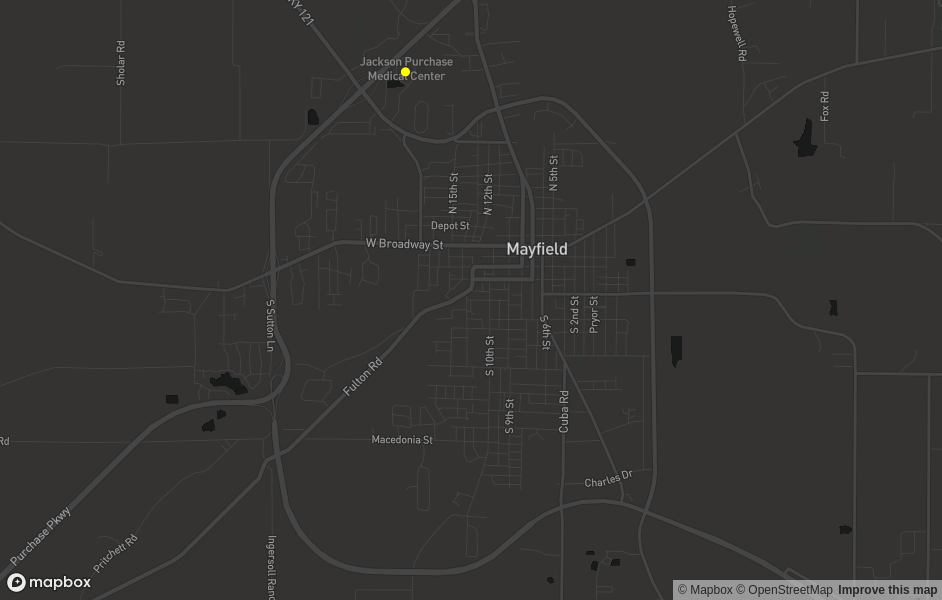
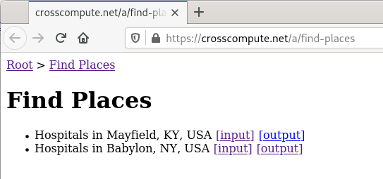
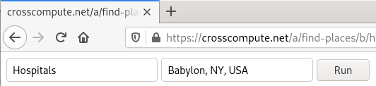
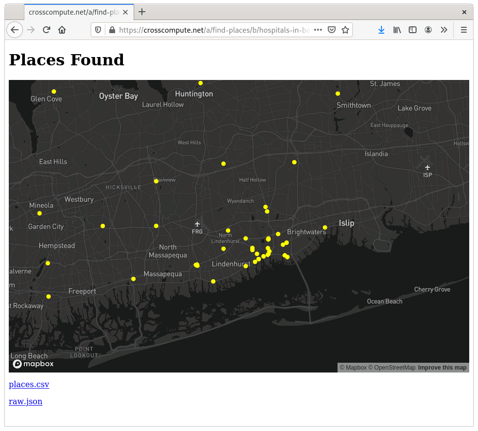

# Locating Hospitals in Mayfield, Kentucky, USA

We locate critical medical infrastructure in Mayfield, Kentucky, USA and present a tool for quickly gathering building location data.

## Purpose
On Friday, December 10, 2021, a tornado hit Mayfield, Kentucky and caused widespread outages. A microgrid can keep critical buildings such as hospitals operational during an emergency. In this report, we will have an initial look at the medical infrastructure of Mayfield, Kentucky in order to set the stage for a microgrid feasibility study.

## Method

We started by identifying critical loads that must have power during an emergency. According to [NYSERDA 17-23 Evaluation of New York Prize Stage 1 Feasibility Assessments](https://www.nyserda.ny.gov/-/media/Files/Publications/Research/Electic-Power-Delivery/17-23-Evaluation-of-New-York-Prize.ashx), critical loads include hospitals, medical centers, clinics and emergency medical care services and facilities.

First, we searched for medical buildings manually using Google Maps. Then, we automated the search using [Google Places API Text Search](https://developers.google.com/maps/documentation/places/web-service/search-text).

## Results

### Places Found

We found one medical center serving Mayfield, Kentucky, which in 2021 had a census count of 9,729 people. [The map shows the hospital is located in the northwest corner of the town](https://crosscompute.net/a/find-places/b/hospitals-in-mayfield-ky-usa/o).

### Find Places

We automated the search to make future searches easier. You can access the tool at https://crosscompute.net/a/find-places.

Two pre-computed batches demonstrate use of the tool.

The input form takes a description and a location. Description should be a building type, such as hospitals or fire stations.

The output report shows an interactive map and and makes available the CSV and raw JSON for download.

The tool uses the CrossCompute framework to wrap a Jupyter Notebook that calls the [Google Places API Text Search](https://developers.google.com/maps/documentation/places/web-service/search-text). Code is available at https://github.com/crosscompute/find-places.

## Conclusion

We hope that our [Find Places](https://crosscompute.net/a/find-places) tool makes future searches for building locations easier for both hazard mitigation planning, infrastructure planning and microgrid planning. The next step in performing the microgrid feasibility study is to estimate the peak load of our system. We will use the [NREL End Use Load Profiles](https://www.nrel.gov/buildings/end-use-load-profiles.html) to estimate peak load for critical medical infrastructure in Mayfield, Kentucky.
